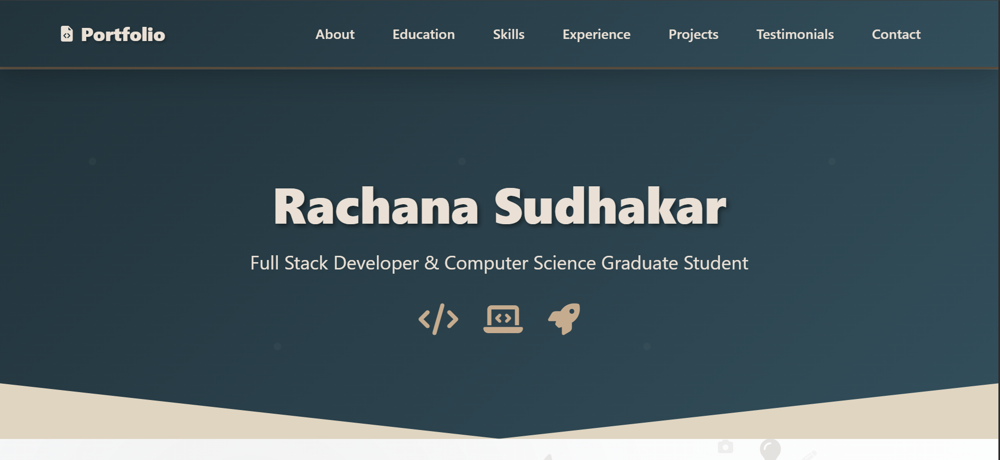
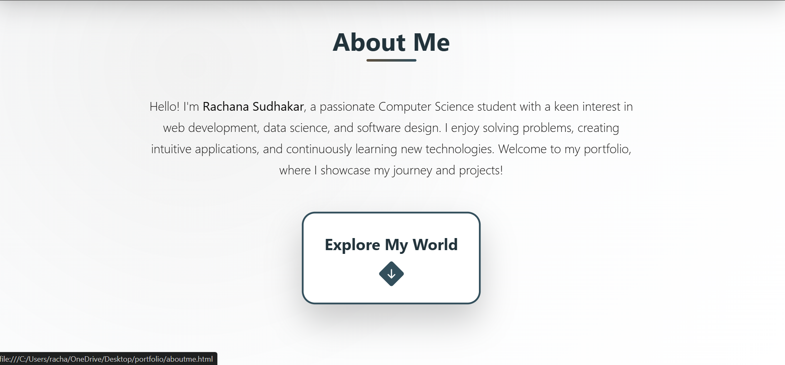
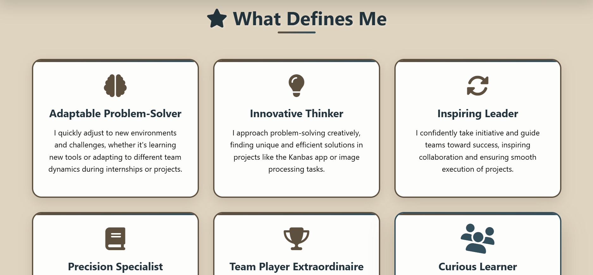
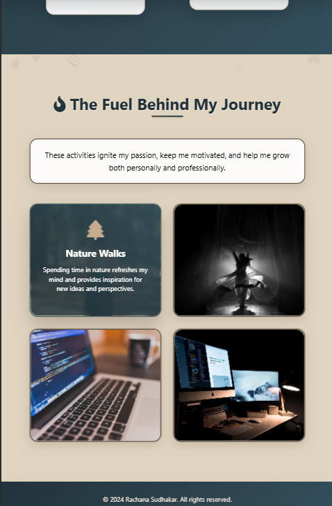
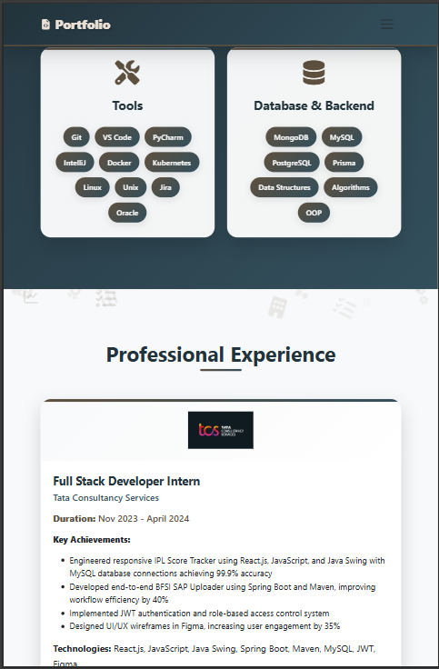

# 🌟 Rachana Sudhakar - Portfolio Website

A modern, responsive portfolio website showcasing my journey as a Computer Science graduate student and full-stack developer. Built with cutting-edge web technologies and featuring dynamic animations, glass morphism design, and contextual floating icons.

## 🚀 Live Demo

[View Live Portfolio](https://rachana1707-s.github.io/portfolio/
) <!-- Replace with your actual URL -->

## 📸 Screenshots

### Main Portfolio

*Clean, professional homepage with dynamic hero section*

### About Me Page
 
*Interactive timeline showcasing personal journey and achievements*

### Mobile Responsive
 
*Fully responsive design optimized for all devices*

## ✨ Features

### 🎨 Design & UI/UX
- **Modern Glass Morphism**: Semi-transparent cards with backdrop blur effects
- **Dynamic Floating Icons**: Contextual animated icons throughout the background
- **Responsive Design**: Mobile-first approach with Bootstrap 5 integration
- **Professional Color Scheme**: Carefully curated palette with CSS custom properties
- **Smooth Animations**: CSS animations and transitions for enhanced user experience

### 📱 Interactive Elements
- **Auto-rotating Carousels**: Projects and testimonials with manual navigation
- **Timeline Animations**: Educational journey with alternating card layout
- **Hover Effects**: Enhanced interactivity with transform and shadow effects
- **Loading Animations**: Professional loading screens with branded spinners
- **Smooth Scrolling**: Navigation with anchor-based smooth scrolling

### 🛠️ Technical Features
- **Clean Code Architecture**: Separated HTML, CSS, and JavaScript files
- **Performance Optimized**: Efficient asset loading and animation management
- **SEO Friendly**: Semantic HTML structure with proper meta tags
- **Accessibility**: ARIA labels, keyboard navigation, and screen reader support
- **Cross-browser Compatible**: Tested across modern browsers

## 🏗️ Project Structure

```
portfolio/
├── index.html              # Main portfolio page
├── aboutme.html            # Personal journey page
├── portfolio.css           # Main portfolio styles
├── aboutme.css            # About page styles
├── README.md              # Project documentation
├── screenshots/           # Portfolio screenshots
│   ├── portfolio-main.png
│   ├── about-me.png
│   └── mobile-view.png
└── assets/               # Media and resources
    ├── exp/              # Experience certificates
    │   ├── tcs.pdf
    │   ├── tcs.webp
    │   ├── bolt.pdf
    │   └── bolt.jpeg
    ├── project1.webp     # Project images
    ├── project2.webp
    ├── project3.jpg
    ├── project4.webp
    ├── project5.jpeg
    ├── project6.webp
    ├── neu_logo.png       # University logos
    ├── dyp_logo.jpeg
    ├── nhss_logo.png
    ├── SoftwareEngineer.pdf # Resume
    └── aboutme/          # Personal photos
        ├── 20240922_145340.jpg
        ├── IMG-20240411-WA0017.jpg
        ├── IMG-20240410-WA0044.jpg
        ├── walks.jpg
        ├── dances.jpeg
        ├── coding.jpg
        └── webb.jpg
```

## 🎯 Sections Overview

### 🏠 Main Portfolio (`index.html`)
1. **Hero Section**: Dynamic introduction with animated icons
2. **About**: Brief overview with link to detailed about page
3. **Education**: Timeline showcasing academic journey
4. **Skills**: Technical expertise organized by categories
5. **Experience**: Professional internships with achievements
6. **Projects**: Featured projects with GitHub links
7. **Testimonials**: Professional recommendations
8. **Contact**: Multiple contact methods with working form

### 👤 About Me Page (`aboutme.html`)
1. **Photo Slideshow**: Personal images with navigation
2. **What Defines Me**: Personal qualities and characteristics
3. **Milestones**: Academic and professional achievements
4. **Lessons Learned**: Growth through experiences
5. **Future Goals**: Career aspirations and roadmap
6. **Personal Fuel**: Hobbies and interests

## 🛠️ Technologies Used

### Frontend Technologies
- **HTML5**: Semantic markup and structure
- **CSS3**: Advanced styling with custom properties
- **JavaScript (ES6+)**: Interactive functionality
- **Bootstrap 5**: Responsive grid and components
- **Font Awesome 6**: Professional icon library

### Design Techniques
- **CSS Grid & Flexbox**: Modern layout systems
- **CSS Animations**: Keyframe animations and transitions
- **Glass Morphism**: Backdrop-filter and transparency effects
- **Responsive Design**: Mobile-first media queries
- **CSS Custom Properties**: Maintainable color system

### Performance & Optimization
- **Lazy Loading**: Efficient image and asset loading
- **CSS Optimization**: Minimal and organized stylesheets
- **Animation Performance**: Hardware-accelerated transforms
- **Asset Optimization**: Compressed images and fonts

## 🚀 Getting Started

### Prerequisites
- Modern web browser (Chrome, Firefox, Safari, Edge)
- Text editor (VS Code, Sublime Text, etc.)
- Basic knowledge of HTML, CSS, and JavaScript

### Installation

1. **Clone the repository**
   ```bash
   git clone https://github.com/rachana1707-S/portfolio.git
   cd portfolio
   ```

2. **Open in your preferred editor**
   ```bash
   code .  # For VS Code
   ```

3. **Launch the website**
   - Open `index.html` in your browser, or
   - Use a local server (recommended):
   ```bash
   # Using Python
   python -m http.server 8000
   
   # Using Node.js
   npx serve .
   
   # Using PHP
   php -S localhost:8000
   ```

4. **View the portfolio**
   - Navigate to `http://localhost:8000` in your browser

## 🎨 Customization Guide

### Updating Personal Information

1. **Basic Info** (`index.html`):
   ```html
   <!-- Update hero section -->
   <h1 class="hero-title">Your Name</h1>
   <p class="hero-subtitle">Your Title</p>
   ```

2. **Contact Information**:
   ```html
   <!-- Update contact details -->
   <a href="mailto:your-email@example.com">your-email@example.com</a>
   <a href="tel:+1234567890">+1 (234) 567-890</a>
   ```

3. **Social Links**:
   ```html
   <!-- Update social media links -->
   <a href="https://github.com/your-username" target="_blank">
   <a href="https://linkedin.com/in/your-profile" target="_blank">
   ```

### Color Customization

Update the CSS custom properties in both CSS files:

```css
:root {
  --dark-navy: #your-color;        /* Primary dark background */
  --teal-blue: #your-color;        /* Secondary dark */
  --warm-brown: #your-color;       /* Accent color */
  --cream: #your-color;            /* Light text/background */
  --warm-beige: #your-color;       /* Hover states */
  /* ... other colors */
}
```

### Adding New Sections

1. **HTML Structure**:
   ```html
   <section id="new-section" class="section">
     <div class="section-floating-icons" id="newSectionFloatingIcons"></div>
     <div class="container">
       <h2 class="section-title">Section Title</h2>
       <!-- Your content here -->
     </div>
   </section>
   ```

2. **Navigation Link**:
   ```html
   <li class="nav-item">
     <a class="nav-link" href="#new-section">New Section</a>
   </li>
   ```

3. **Floating Icons** (JavaScript):
   ```javascript
   // Add to iconSets object
   newSection: [
     'fas fa-icon1', 'fas fa-icon2', 'fas fa-icon3'
   ]
   ```

## 📝 Content Management

### Adding New Projects

1. **Update the projects carousel** in `index.html`:
   ```html
   <div class="col-lg-4 col-md-6">
     <div class="project-card">
       
       <div class="project-content">
         <h4 class="project-title">Your Project Name</h4>
         <p class="project-description">Project description...</p>
         <a href="https://github.com/your-username/project" target="_blank" class="btn-github">
           <i class="fab fa-github me-2"></i>View on GitHub
         </a>
       </div>
     </div>
   </div>
   ```

### Adding Experience

1. **Update experience section**:
   ```html
   <div class="col-lg-6">
     <div class="card experience-card h-100">
       
       <div class="card-body p-4">
         <h4 class="experience-title">Your Position</h4>
         <h5 class="experience-company">Company Name</h5>
         <p class="experience-duration"><strong>Duration:</strong> Start - End</p>
         <!-- Add achievements and technologies -->
       </div>
     </div>
   </div>
   ```

## 🔧 Performance Optimization

### Image Optimization
- **WebP Format**: Use WebP images for better compression
- **Appropriate Sizing**: Resize images to display dimensions
- **Lazy Loading**: Implement for better page load times

### CSS Optimization
- **Minimize CSS**: Remove unused styles
- **Critical CSS**: Inline critical styles for faster rendering
- **CSS Sprites**: Combine small icons into sprite sheets

### JavaScript Optimization
- **Event Delegation**: Use efficient event handling
- **Animation Performance**: Use `transform` and `opacity` for animations
- **Memory Management**: Properly clean up event listeners

## 🌐 Deployment Options

### GitHub Pages
1. **Push to GitHub**:
   ```bash
   git add .
   git commit -m "Initial portfolio commit"
   git push origin main
   ```

2. **Enable GitHub Pages**:
   - Go to repository Settings
   - Navigate to Pages section
   - Select source branch (main)
   - Your site will be available at `https://username.github.io/repository-name`

### Netlify
1. **Deploy from Git**:
   - Connect your GitHub repository
   - Build command: (leave empty)
   - Publish directory: `.` (root)

### Vercel
1. **Deploy with Vercel**:
   ```bash
   npm i -g vercel
   vercel
   ```

### Traditional Hosting
1. **Upload files** via FTP/SFTP to your hosting provider
2. **Ensure** `index.html` is in the root directory

## 🤝 Contributing

Contributions, issues, and feature requests are welcome! Feel free to check the [issues page](https://github.com/rachana1707-S/portfolio/issues).

### How to Contribute

1. **Fork the Project**
2. **Create your Feature Branch** (`git checkout -b feature/AmazingFeature`)
3. **Commit your Changes** (`git commit -m 'Add some AmazingFeature'`)
4. **Push to the Branch** (`git push origin feature/AmazingFeature`)
5. **Open a Pull Request**

## 📄 License

This project is licensed under the MIT License - see the [LICENSE](LICENSE) file for details.

## 📞 Contact

**Rachana Sudhakar** - [rachanasudhakar17@gmail.com](mailto:rachanasudhakar17@gmail.com)

- 🌐 **Portfolio**: [https://your-portfolio-url.com](https://your-portfolio-url.com)
- 💼 **LinkedIn**: [https://linkedin.com/in/rachanasudhakar](https://linkedin.com/in/rachanasudhakar)
- 🐱 **GitHub**: [https://github.com/rachana1707-S](https://github.com/rachana1707-S)
- 📱 **Phone**: +1 (617) 602-3398
- 📍 **Location**: Boston, MA, USA

## 🙏 Acknowledgments

- **Bootstrap Team** for the excellent CSS framework
- **Font Awesome** for the comprehensive icon library
- **Unsplash/Pexels** for high-quality stock images
- **Google Fonts** for beautiful typography options
- **MDN Web Docs** for excellent web development resources

## 🔮 Future Enhancements

- [ ] **Dark Mode Toggle**: Implement theme switching functionality
- [ ] **Blog Section**: Add a blog for sharing technical articles
- [ ] **Advanced Animations**: Implement more sophisticated CSS animations
- [ ] **CMS Integration**: Add headless CMS for easier content management
- [ ] **Multi-language Support**: Implement internationalization
- [ ] **Analytics**: Add Google Analytics for visitor insights
- [ ] **PWA Features**: Make the portfolio a Progressive Web App
- [ ] **Advanced SEO**: Implement structured data and meta optimization

---

⭐ **If you found this portfolio helpful, please give it a star!** ⭐

*Built with ❤️ by Rachana Sudhakar*
